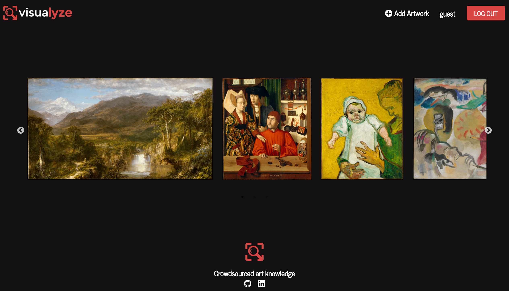

# Visualyze

[Visualyze](vizualyze.herokuapp.com) is a web application for users to view and annotate works of art. Inspired by Genius (a lyrics annotation website), Visualyze allows users to upload works of art, annotate specific parts of an artwork, and make comments.

Visualyze is a personal project by Virginia Chen.

## Features

* User accounts with secure authentication, including a demo login
* Artwork uploading and deletion
* Ability to add annotations by selecting parts of the artwork
* Artwork comments
* Upvotes and downvotes of annotations and comments

## Project Design

Visualyze was designed and built over a period of two weeks. A [proposal](./docs/production_README.md) was created for the implementation, which included an implementation timeline, initial [wireframes](./docs/wireframes), and
a [database schema](./docs/schema.md).

## Technology

Visualyze is a single-page application built on Rails version 5.0 and React.js version 15.6. React was used along with react-router 4.1, webpack 3.3, and the redux 3.7 implementation of the flux architecture.

All images are hosted using Cloudinary.

### Artwork

Logged in users are able to upload and delete artwork. Uploaded artwork can be found and accessed on the home page via an image carousel.



Each artwork has its own show page, which contains detailed information about each work of art, as well as any annotations or comments that have been made by users about the artwork.


When users hover over the image, any annotation pointers that have been created will become visible and clickable.

The user needs to be logged in to upload new artwork. He/she needs to populate the artwork creation form and upload an image of the artwork. The Cloudinary upload widget was used to achieve this functionality.


Only the user who uploaded the artwork will be able to delete it.

### Annotations

Annotations are how users can add further details about specific parts of an artwork. All users can view annotations, but they need to be logged in to create new annotations.

The user needs to hover over the artwork image to see the pointers of all the annotations that have been created. To view the details of an annotation, the user simply needs to click on a pointer to open the annotation box.


To create a new annotation, a user needs to click on any point on the artwork that they wish to annotate. This causes an annotation creation form to pop-up, which the user can populate and save.


Annotation pointer locations are initially calculated as pixel x and y positions relative to the image on the screen. These are then saved to the database as percentages of the height and width of the artwork.

Each time a user views an artwork, the positions of the annotation pointer are then converted back into pixel x and y positions, in order to ensure the right positioning of the pointers regardless of screen size/position. The positions recalculate each time the screen is resized.

```javascript
renderPointers() {
  if ($("#artwork-img").offset()) {
    let imageDimensions = [($("#artwork-img").width()),($("#artwork-img").height())];
    let artwork = this.props.artwork;
    let allAnnos = merge({},this.props.annotations);

    let annotationsWithPixelPos = Object.keys(allAnnos).map(anno => {
      let pixelAnno = allAnnos[anno];
      pixelAnno['x_pos'] = Math.floor(((pixelAnno['x_pos']*imageDimensions[0])/100))+$("#artwork-img").offset().left;
      pixelAnno['y_pos'] = Math.floor(pixelAnno['y_pos']*($("#artwork-img").height()/100))-($("#artwork-img").offset().top);

      let style = {
        position: 'absolute',
        top: pixelAnno['y_pos']+'px',
        left: pixelAnno['x_pos']+'px'
      };
      return {pixelAnno: pixelAnno, style: style};
    });

    return (
      annotationsWithPixelPos.map(anno => (
        <button className="pointers" key={`anno-pointer-${anno.pixelAnno.id}`} onClick={this.handleAnnoClick.bind(null,anno.pixelAnno.id)} style={anno.style}>
          <i id="pointer" className="fa fa-dot-circle-o fa-lg" aria-hidden="true"></i>
        </button>
      ))
    );
  }
}
```

Only the user who creates a specific annotation will be able to delete it.

### Comments

In addition to annotating specific points of the artwork, users can also add comments to the artwork overall. Only the user who creates a specific comment will be able to delete it.


### Votes

Users can give an up- or down-vote for all annotations and comments. Once a user has given a vote, the thumb icon will change color based on the vote given. A user is restricted from giving more than one vote in any given annotation or comment.

The total score of votes an annotation or comment has is shown in the number between the two voting icons.

## Future Improvements

### Search

Ability to search for artwork via title, artist, date range, etc.

### Draggable annotation boxes

The ability for a user to drag their cursor on an artwork to create an annotation about a specific area instead of just one point on the image.

### Walkthrough tour

Add a walkthrough feature to make it clear how to view and add annotations (i.e. using React Joyride).

### Artist pages

Artist pages with artist information and links to all artwork that have been uploaded for that artist.

## Credits

Credits and thanks go to my instructors and peers at App Academy.

Artwork seed images were provided by the <a href="http://www.metmuseum.com">Metropolitan Museum of Art</a>, under the CC0 license. Descriptive text were also provided by the Met: www.metmuseum.org.

Magnifying Glass graphic by <a href="http://www.flaticon.com/authors/freepik">freepik</a> from <a href="http://www.flaticon.com/">Flaticon</a> is licensed under <a href="http://creativecommons.org/licenses/by/3.0/" title="Creative Commons BY 3.0">CC BY 3.0</a>. The logo was created using <a href="http://logomakr.com" title="Logo Maker">LogoMaker.com</a>
